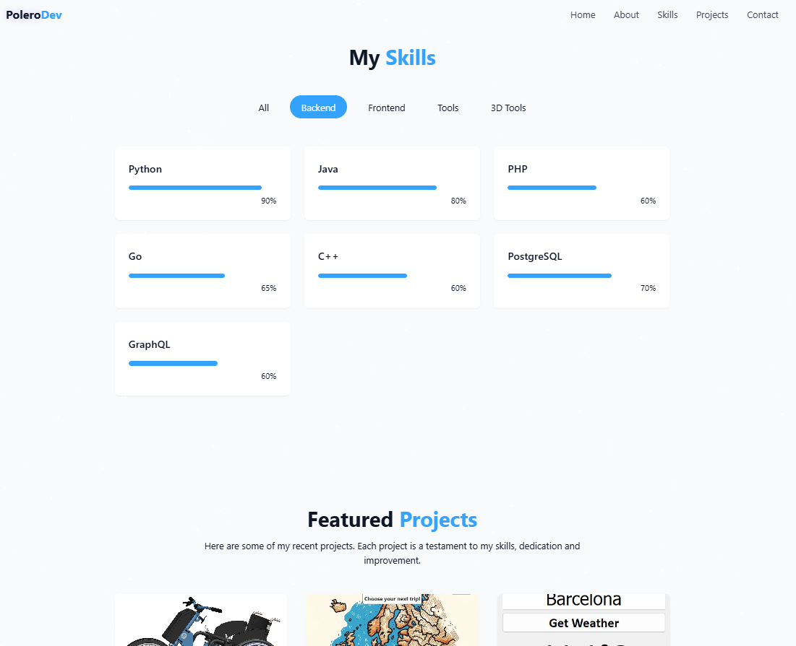

# Pol Moreno Garcia - Portfolio

  

    
    
    
    
    
  

   

## 📋 Table of Contents

1. [Introduction](#-introduction)
2. [Tech Stack](#-tech-stack)
5. [Screenshots](#-screenshots)

---
 

## 🚀 Introduction

Welcome to my personal portfolio! This project showcases my skills, experience, and passion as a Mechanical Engineer and Software Developer. It has been carefully designed and developed to reflect my journey and projects in both engineering and programming.
 
 

## ⚙️ Tech Stack

* **React** – Component-based UI development
* **Vite** – Lightning-fast build tool
* **TailwindCSS** – Utility-first CSS for styling
* **Lucide Icons** – Clean and beautiful icon pack
* **Radix UI** – Accessible component primitives
* **TypeScript (optional)** – Type safety and tooling
* **GitHub & Vercel** – Deployment

 

## 🖼️ Screenshots

  
   
   
  
   
   
  

 

## 🔗 Useful Links

* [React Documentation](https://reactjs.org/)
* [Tailwind CSS Docs](https://tailwindcss.com/)
* [Lucide Icons](https://lucide.dev/)
* [Radix UI](https://www.radix-ui.com/)
* [Vite](https://vitejs.dev/)
* [Vercel](https://vercel.com/)

## **Project Overview**
This portfolio is based on a template designed by PedroTech. I've extensively customized and modified it to better fit my personal style and needs. The website is designed to be fully responsive and optimized to give visitors a seamless experience across all devices.

